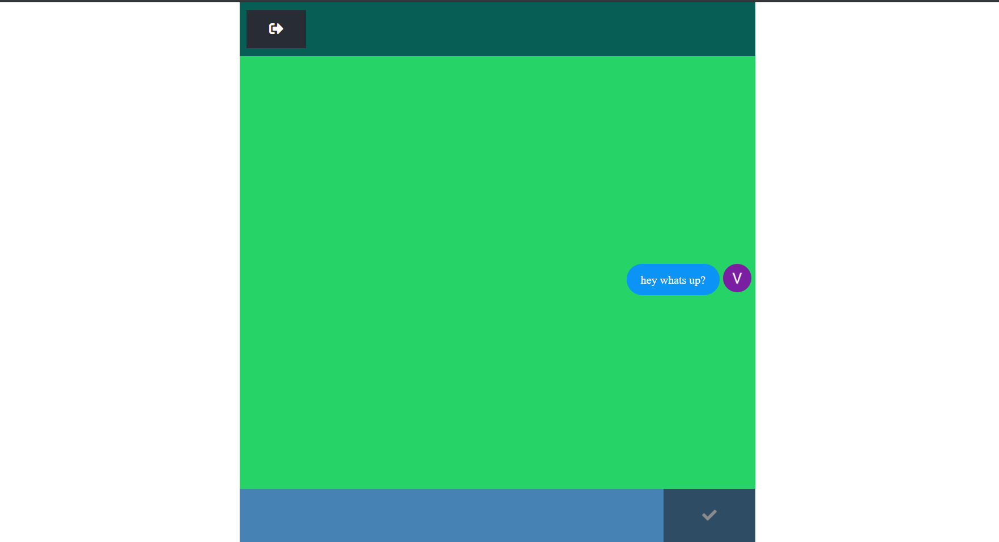

# React-Firebase-Chat App



## Installation
Öncelikle projeyi clonelayın.
```
https://github.com/VolkanGoksu/React-ChatApp.git
```


## Usage

Projeyi cloneladıktan sonra Visual Studio Code programında açınız.


## Contributing

Pull requestler kabul edilir. Büyük değişiklikler için, lütfen önce neyi değiştirmek istediğinizi tartışmak için bir konu açınız.
